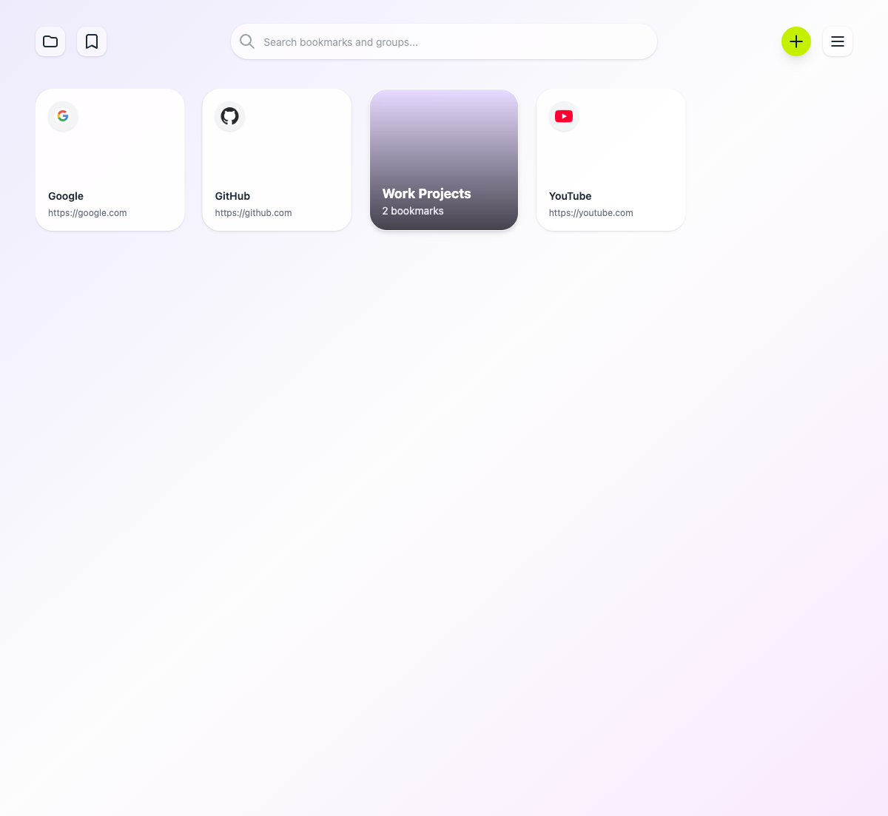

# BentoMark - Chrome New Tab Extension

**BentoMark** is a highly visual, modern Google Chrome Extension built on Manifest V3. It completely replaces the browser's default "New Tab" page, transforming it into a beautiful, customizable bookmark manager and moodboard.



## ✨ Features

- **Visual Bookmark Cards:** Say goodbye to boring lists. BentoMark displays your bookmarks as beautiful cards in a responsive grid.
- **Smart Groups & Infinite Nesting:** Organize your bookmarks into visual folders (groups). You can nest folders inside other folders to any depth. Click on a group to dive inside and navigate back up via a smart history breadcrumb.
- **Advanced Drag & Drop:**
  - Freely sort bookmarks and groups anywhere on the board.
  - **Nested Drop:** Drag a bookmark or a folder into the center of another folder to nest it.
  - **Upward Extraction:** Drag an item onto the "Back" breadcrumb button to instantly move it one level up in the folder hierarchy (or to the main screen).
  - **External Drop:** Drag and drop URLs directly from other browser tabs into BentoMark to instantly save them!
- **Smart Item Creation:** Choose exactly which parent folder a new bookmark or group should belong to right from the Add modal.
- **Customization & Aesthetics:**
  - **Themes:** Light, Dark, or System Sync.
  - **Styles:** Choose between a classic "Solid" design or a modern macOS-inspired "Liquid Glass" (frosted glass) aesthetic.
  - **Covers:** Upload custom cover images for your background, groups, and even individual bookmarks.
  - **Grid Density:** Adjust the number of columns (2 to 8) to fit your screen perfectly.
- **Lightning Fast Search:** Instantly filter through all your bookmarks and folders by title or URL right from any screen.
- **Recursive Chrome Bookmarks Import:** Easily fetch and migrate your existing Chrome bookmarks. BentoMark faithfully recreates your entire browser folder hierarchy 1-to-1 automatically.
- **Cloud Sync & Backup:** Your folder structure and settings are automatically synced across your devices using your Google Account (`chrome.storage.sync`). You can also export/import your setup as a JSON file.

## 🛠️ Tech Stack

- **Framework:** Vue 3 (Composition API, `<script setup>`)
- **State Management:** Pinia
- **Styling:** TailwindCSS v4
- **Drag & Drop:** `vuedraggable` (Sortable.js)
- **Build Tool:** Vite + `@crxjs/vite-plugin` (Manifest V3)
- **Storage:** `chrome.storage.sync` (state), `chrome.storage.local` (fallback), `localforage` (IndexedDB for heavy media like cover images).

## 🚀 Installation & Development

### Prerequisites

- Node.js (v18+)
- npm

### Setup

1. Clone the repository.
2. Install dependencies:
   ```bash
   npm install
   ```
3. Run the development server (with HMR):
   ```bash
   npm run dev
   ```
4. Build for production:
   ```bash
   npm run build
   ```

### Loading into Chrome

1. Build the project using `npm run build`. This creates a `dist` folder.
2. Open Google Chrome and go to `chrome://extensions/`.
3. Enable **Developer mode** (toggle in the top right).
4. Click **Load unpacked** and select the generated `dist` folder.
5. Open a new tab to see BentoMark in action!

---

_Built as a modern alternative to traditional bookmark managers._
